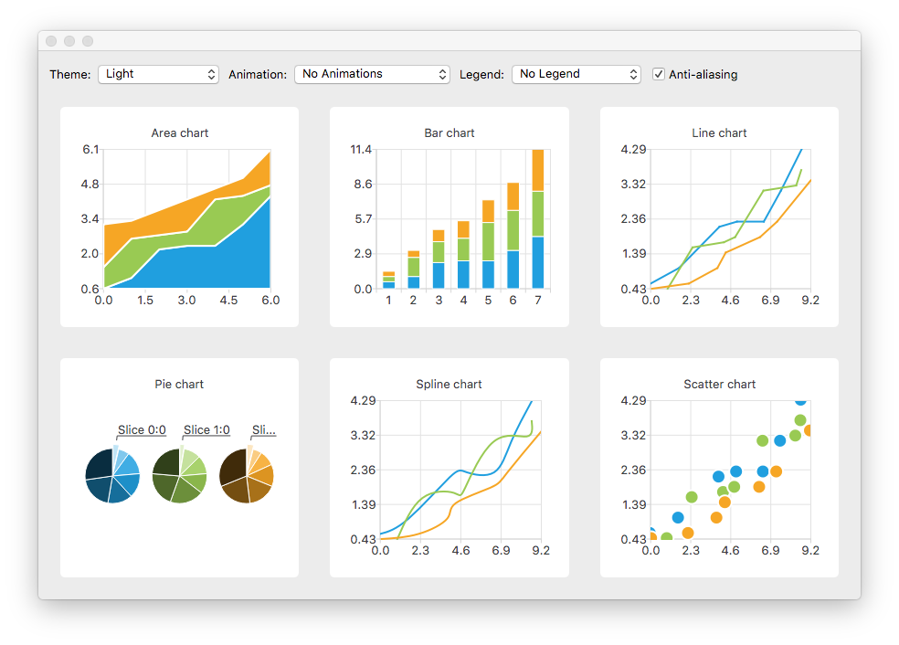

### Setup Instruction for macos 

Install Qt5. You can do easily with `brew`

```
brew install qt5
```

Add some missing links that should be really there

```
ln -s /usr/local/Cellar/qt5/5.9.3/mkspecs /usr/local/mkspecs &&
ln -s /usr/local/Cellar/qt5/5.9.3/plugins /usr/local/plugins
```
(assuming the version 5.9.3 was installed, otherwise adjust)


----
After having cloned this project, initialize the submodule that come with it

```
git submodule init
git submodule update
```
This will put in place the QtChart subproject, that comes with the examples.

----
Create a build directory, call cmake and then make to build the examples

```
mkdir cmake-build-debug
cd cmake-build-debug
cmake ..  -DCMAKE_BUILD_TYPE=Debug 
make
```

---

**That's all**